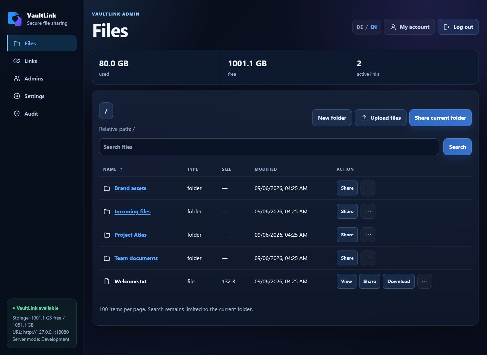
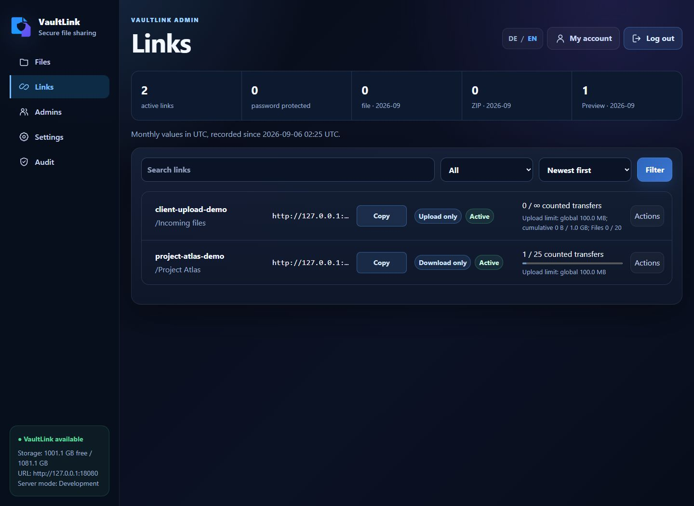
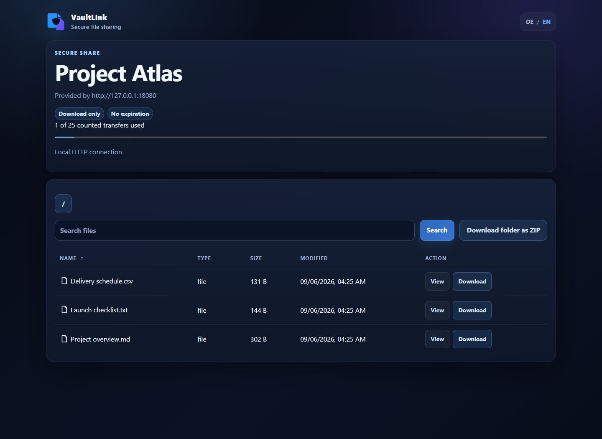
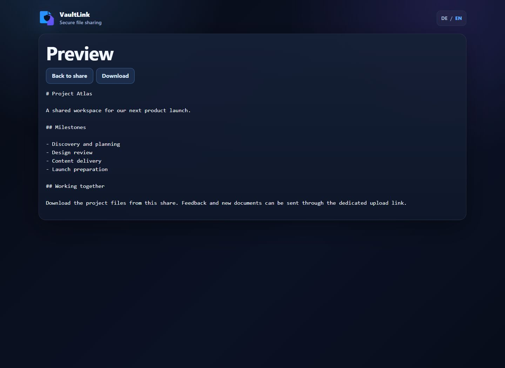

# VaultLink

VaultLink shares files from an existing Linux storage mount through download and
upload links. Manage files in the web interface and let recipients open their
links in a browser. Storage can be local or an existing SMB share.

Status: `0.7.0` is unreleased development. The currently supported release is `v0.6.0`.
See the [changelog](CHANGELOG.md) and [release status](release/release-state.json).

## Screenshots

| File browser | Share management |
| --- | --- |
| [](docs/screenshots/file-browser.jpg) | [](docs/screenshots/share-management.jpg) |
| Browse and organize files, upload content, and create shares. | Review active links, permissions, transfer counts, and upload limits. |

| Public download page | File preview |
| --- | --- |
| [](docs/screenshots/public-download.jpg) | [](docs/screenshots/file-preview.jpg) |
| Recipients can browse shared files and download a folder as ZIP. | Read supported files in the browser before downloading. |

## Features

- Browse, search, upload, and organize files from the administrator interface.
- Create download-only, upload-only, or combined links, with optional passwords,
  expiration dates, transfer limits, and upload quotas.
- Let recipients download individual files or folders as ZIP and preview
  supported text, images, and PDFs. Upload-only links keep existing files hidden.
- Protect administrator access with TOTP or WebAuthn/FIDO2 security keys and
  record activity in an audit log.
- Use the English or German interface, with HTTPS through a reverse proxy or
  built-in TLS, including Let's Encrypt.

These features are available in 0.6.0. Monitoring endpoints and service tokens
are part of the unreleased 0.7.0 development line.

## Installation

VaultLink runs on Linux. Recipients use a browser on Windows, macOS, or Linux;
SMB clients are only needed for optional direct access to an external SMB share.

| Supported operating system | Architectures | Package |
| --- | --- | --- |
| Debian 13 | amd64, arm64 | DEB |
| Ubuntu 24.04 / 26.04 LTS | amd64, arm64 | DEB |
| Fedora 44 | x86_64, aarch64 | RPM |
| Arch Linux, release-date snapshot | x86_64 | `.pkg.tar.zst` |

1. Download the matching package from the
   [supported 0.6.0 release](https://github.com/alexhaberl/VaultLink/releases/tag/v0.6.0).
2. Follow the [verification and installation instructions](docs/INSTALLATION.md#native-package-deployment)
   to verify both the signature and signed checksum before installing.
3. Prepare the [storage mount and HTTPS configuration](docs/CONFIGURATION.md).
   Production requires a validated mount and private service-owned directories;
   keep SQLite on a supported local filesystem.
4. Complete [browser setup through an SSH tunnel](docs/INSTALLATION.md#initial-browser-setup-through-an-ssh-tunnel),
   save the initial TOTP secret, and start the service.

The package leaves the service and automatic updates disabled until configured.
Only the listed OS versions and architectures are supported. GitHub source
archives are not installation packages. The withdrawn 0.5.0 archive has no
supported in-place upgrade path; see the [release history](CHANGELOG.md).

For a local development preview, follow the [container setup guide](docs/CONTAINER-SETUP.md).
Its smoke image includes build tools and is intended for development and testing.

## Configuration and operation

Use the configuration examples from your installed release. The
[configuration guide](docs/CONFIGURATION.md) covers reverse proxies, standalone
TLS, Let's Encrypt, local storage, and shared SMB access. The `[admission]`
configuration section in this development checkout requires 0.7.0.

- Run one VaultLink instance per storage root; overlapping active instances are unsupported.
- Use HTTPS in production. Keep the setup interface on loopback and access it through SSH.
- Back up the matching configuration, SQLite database, and `secrets.keyring`
  together with the runtime. See [updates and rollback](docs/UPGRADE-ROLLBACK.md).
- See [administrator recovery](docs/INSTALLATION.md#local-administrator-recovery)
  if you lose access, and the [security policy](SECURITY.md) for operating requirements
  and private vulnerability reporting.

## API and monitoring

The [JSON API](docs/API.md) uses `/api/v2` with administrator sessions, MFA, and
CSRF protection. Health probes are unauthenticated:

| Endpoint | Purpose |
| --- | --- |
| `/api/v2/health/live` | Process liveness |
| `/api/v2/health/ready` | Database and storage readiness; HTTP 503 when unavailable |

**0.7.0, unreleased:** [read-only monitoring](docs/MONITORING-API.md) adds instance
and Share summaries plus service tokens restricted to `monitoring:read`.
These endpoints and tokens are unavailable in 0.6.0. The 0.7.0 Share search also
requires at least three characters for a nonempty query; see the [API reference](docs/API.md#json-api-routes).

## Linux development

These commands build the checked-out development branch:

```sh
sudo apt update && sudo apt install -y build-essential coreutils curl libssl-dev pkg-config sqlite3 util-linux
curl --proto '=https' --tlsv1.2 -sSf https://sh.rustup.rs | sh
. "$HOME/.cargo/env"
make dev-setup
cargo run -- init-admin --config config/development.toml --username admin
make run
```

`make sample-data` creates `dev/mount` and `dev/data`. With Docker available, `make docker-smoke` builds the digest-pinned Debian-13/Rust image and runs setup, API, load-fixture, soak-evidence, upgrade, and rollback tests without external container networking. Individual Docker targets remain available. The [container setup entrypoint](docs/CONTAINER-SETUP.md) keeps VaultLink on loopback and publishes a separate proxy port. `make policy-check` validates project supply-chain rules.

## Documentation

| Guide | Contents |
| --- | --- |
| [Installation](docs/INSTALLATION.md) | Signed package installation, initial setup, updates, and administrator recovery |
| [Configuration](docs/CONFIGURATION.md) | Storage layouts, SMB permissions, HTTPS, and configuration examples |
| [API reference](docs/API.md) | Browser routes, JSON endpoints, authentication, and search parameters |
| [Monitoring API — 0.7.0, unreleased](docs/MONITORING-API.md) | Monitoring resources, service tokens, and token recovery |
| [Architecture and internals](docs/INTERNALS.md) | Security mechanisms, project layout, persistence, and schema migrations |
| [Updates and rollback](docs/UPGRADE-ROLLBACK.md) | Package-bound updates, backups, and recovery |
| [Package contract](docs/PACKAGING.md) | Package contents, target matrix, and build/release requirements |
| [Threat model](THREAT_MODEL.md) | Trust boundaries, security invariants, and accepted risks |

The supported 0.6.0 release uses database schema 6; this 0.7.0 development branch
uses schema 10. See [data and persistence](docs/INTERNALS.md#data-and-persistence)
for migration details. Release evidence is linked from
[release/release-state.json](release/release-state.json), including the supported
release checklist and the development qualification ledger.

## Troubleshooting

- Startup refused: verify config mode, HTTPS URL, loopback/trusted proxies, PEM/ACME settings, and the storage mount identity.
- Built-in ACME fails: DNS must point to the server, VaultLink must terminate port 443 itself, and Nginx/Caddy must not be in front.
- File request returns 403: path validation or the symlink boundary rejected it.
- Upload returns 409: no-overwrite is the default. Without external writers, replacement must be enabled per link and confirmed per upload; co-writer mode keeps it disabled unless its explicit risk opt-in is set.
- SMB startup refused: verify source/type/options in `/proc/self/mountinfo`, the pre-existing `.vaultlink-internal` layout, mode `0700`, server ACL, and local SQLite filesystem.
- TLS remains old after renewal: inspect `systemctl status vaultlink`, PEM permissions, and the journal.

## License

MIT. See [LICENSE](LICENSE).
