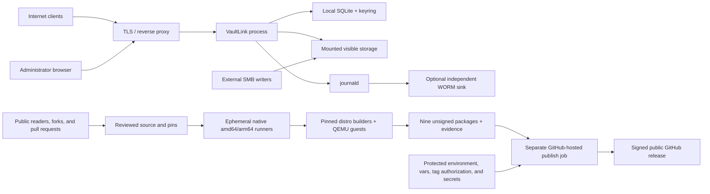

# VaultLink threat model

| Field | Value |
| --- | --- |
| Last reviewed | 2026-08-28 |
| Baseline commit | 0.6.0 release candidate planned for 2026-08-31; the exact final commit is recorded before the soak |
| Applies to | VaultLink 0.6.0 native packages listed in [PACKAGING.md](docs/PACKAGING.md) |
| Companion documents | [Security policy](SECURITY.md), [0.6.0 release checklist](docs/RELEASE-CHECKLIST-0.6.0.md), [runner strategy](docs/GITHUB-HOSTED-RUNNERS.md) |

## Purpose

This document describes what VaultLink protects, which actors and systems are
trusted, how trust boundaries are crossed, and which residual risks are
accepted. It is an engineering threat model, not a claim that a deployment is
secure independently of its host, reverse proxy, storage server, or operating
procedures.

The model is intentionally organized around security invariants and concrete
abuse cases. `SECURITY.md` remains authoritative for supported versions,
operational requirements, the compensated WebAuthn RSA advisory, and private
vulnerability reporting.

## Scope and security objectives

VaultLink is a single-process, Linux-only service that exposes an existing
mounted directory through administrator sessions and public bearer links. It
stores policy and security state in a local SQLite database and protects stored
application secrets with an adjacent keyring. It supports a service-owned local
storage mode and a narrowly defined CIFS/SMB external-writer mode.

The security objectives are:

- confine every file operation to the capability and policy assigned to the
  administrator or public Share;
- preserve confidentiality and integrity of credentials, Share policy,
  application-owned secret state, and release signing material;
- make security-relevant database mutations and their required audit records
  atomic;
- bound attacker-controlled CPU, memory, connection, database, and filesystem
  work;
- fail closed when storage identity, configuration, key material, release
  inputs, or required evidence is missing or inconsistent;
- make accepted operational trust and residual risks explicit.

## Non-goals and trusted foundations

VaultLink does not claim to protect against:

- a malicious or fully compromised host root administrator, kernel, hypervisor,
  or GitHub control plane;
- physical access to an unencrypted host, backup, or storage device;
- an independently compromised reverse proxy or SMB server operating with the
  authority intentionally assigned to it;
- unlimited volumetric denial of service without upstream network controls;
- active-active operation or high availability for one storage-root and
  data-directory pair;
- audit immutability when events remain solely on the VaultLink host;
- direct changes made by an authorized external SMB writer bypassing VaultLink
  authentication, audit, link policy, and quotas;
- confidentiality after an administrator or recipient intentionally downloads
  or shares plaintext content.

The supported deployment trusts the exact Debian, Ubuntu, Fedora, or Arch
package target named in `docs/PACKAGING.md`, the Linux security primitives used
by VaultLink, the native package database, the configured TLS endpoint, the
audited local filesystem, and the operator-managed identities and ACLs
described in `SECURITY.md`. Required kernel primitives include `openat2(2)`,
`renameat2(2)`, and statx mount IDs. A derivative or different OS release is
not assumed equivalent.

## Protected assets

| Asset | Required property |
| --- | --- |
| Visible storage content and names | Access only through the configured root, Share capability, and mutation policy |
| Administrator credentials and MFA state | Confidentiality, replay resistance, and authenticated lifecycle changes |
| Sessions, CSRF values, Share tokens, and preview/unlock state | Unpredictability, bounded lifetime, correct binding, and revocation |
| SQLite policy and accounting state | Transactional integrity, schema authenticity, and bounded resource use |
| `secrets.keyring` and encrypted database fields | Confidentiality, exact database/keyring pairing, and atomic rotation |
| Configuration, mount identity, and internal storage | Fail-closed validation and service-only modification |
| Audit records | Atomicity for required events, bounded retention, and honest trust-boundary documentation |
| Backups, old packages, and rollback units | Confidentiality and inseparable package/binary/config/database/keyring consistency |
| Source, dependencies, target manifest, builder/guest images, and workflow definitions | Reviewed immutable inputs and reproducible provenance |
| Minisign private key and publication token | Exposure only to the isolated tag-only publish job |
| Release artifacts, SBOMs, checksums, and evidence | Exact-commit integrity, architecture identity, and verified signatures |

## Threat actors and capabilities

| Actor | Assumed capabilities | Not assumed |
| --- | --- | --- |
| Unauthenticated network client | Send malformed, slow, parallel, and spoofed requests; guess credentials and bearer links | Host, proxy, or database access |
| Public Share holder | Exercise every operation permitted by a leaked or intentionally shared bearer link | Administrator privileges or access outside that Share |
| Malicious uploader | Choose filenames, metadata, multipart framing, sizes, timing, and cancellation behavior | Direct access to protected internal staging |
| Authenticated administrator | Use all documented administrator operations and see all visible storage | Host root, keyring plaintext, arbitrary audit deletion, or release authority |
| Compromised administrator browser | Reuse browser-visible responses and submit requests within cookie and CSP constraints | Reading `HttpOnly` cookies without another browser compromise |
| External SMB writer | Modify visible content with the server-side rights explicitly granted to its SMB identity | Access to `.vaultlink-internal`, local SQLite/keyring, or VaultLink process memory |
| Reverse proxy | Terminate TLS and, when allowlisted, assert a validated forwarding chain | Application, database, storage, or signing authority |
| Local unprivileged user | Interact with host resources allowed by Linux permissions | `vaultlink` uid, root, protected files, or Docker-group authority |
| Host or storage administrator | Control the system or service inside the documented trust boundary | Independence for tamper-resistant audit evidence |
| Repository contributor or dependency author | Propose source, workflow, lockfile, action, or container changes for review | Release tag authorization or repository-secret access by default |
| Compromised GitHub-hosted CI job | Control its ephemeral workspace, job-scoped token, and produced artifacts | Persistence into another job or access to signing secrets and write authority not assigned to that job |
| Authorized release maintainer | Change reviewed repository configuration and push the annotated release tag | Permission to bypass exact-commit, evidence, pin, or key checks without changing reviewed controls |

## System and trust boundaries

| Boundary | Security decision |
| --- | --- |
| TB-01 Internet to TLS endpoint | The proxy/network layer handles volumetric defense and transport security; VaultLink still validates every application request |
| TB-02 Reverse proxy to VaultLink | Forwarding headers are trusted only from exact configured TCP peers and only after full chain validation |
| TB-03 Bearer or administrator state to an operation | Session, Share, CSRF, MFA, expiry, permission, and quota checks are performed before protected work |
| TB-04 VaultLink to SQLite/keyring | Local permissions, schema checks, keyring pairing, transactions, and required audit protect application state |
| TB-05 VaultLink to mounted storage | Descriptor-relative capabilities, mount identity, internal namespaces, and atomic publication confine filesystem effects |
| TB-06 External SMB writer to visible storage | External writers are trusted publishers but remain excluded from internal storage and local security state |
| TB-07 VaultLink host to external audit sink | The local host is not an independent witness; WORM forwarding is required when tamper resistance matters |
| TB-08 Reviewed source to GitHub-hosted CI | Full-SHA and digest pins, one declarative target manifest, ephemeral native jobs, target builders/guests, package allowlists, and reproducibility evidence constrain build inputs; GitHub's runner, registry, and artifact isolation remain trusted |
| TB-09 Public repository activity to secret-bearing publication | Public visibility grants read, fork, and pull-request access, not tag creation, environment approval, signing/policy secrets, or publication authority; publication additionally requires public visibility, an authorized version tag, the protected `release-signing` environment, and an admin-read proof that Immutable Releases is enabled |
| TB-10 Maintainer authorization to release | An annotated version tag must equal the approved `main` commit, the repository must be public, environment approval must succeed, and all exact-commit evidence must pass |

## Security invariants

These properties are intended to remain true across all supported deployments.
A change that weakens one requires an explicit threat-model review.

| ID | Invariant | Primary enforcement and evidence |
| --- | --- | --- |
| INV-01 | A user-controlled path never escapes its assigned storage capability | `src/path_security.rs`, `src/secure_fs/`, path and symlink-race fuzz/smoke tests |
| INV-02 | Required storage cannot silently fall back to a different or local directory | `src/storage_mount.rs`, exact filesystem/source/mount-ID checks, mount-race tests |
| INV-03 | Public upload staging is never writable through the visible namespace or an external SMB identity | protected `.vaultlink-internal`, server-side ACL requirements, upload and CIFS gates |
| INV-04 | Visible publication is atomic and never silently clobbers unless the explicit external-writer replacement risk is enabled | `renameat2` no-replace publication, overwrite policy tests, documented last-writer-wins exception |
| INV-05 | A required-audit database mutation cannot commit without its audit row | `src/db/required_audit.rs`, transaction rollback tests |
| INV-06 | A filesystem operation already made visible is never falsely reported as safely retryable after later audit uncertainty | `202 audit_durability_uncertain`, persistent file-operation journal, recovery tests |
| INV-07 | Stored application secrets require the matching protected keyring and are validated before service operation | `src/db/keyring.rs`, startup decryption probes, rotation and restart tests |
| INV-08 | Unknown and known administrator usernames consume the same admitted Argon2 resource class | shared Argon2 semaphore and dummy hashing path in `src/http_auth.rs` and `src/services/auth.rs` |
| INV-09 | An untrusted network peer cannot assert another client identity through forwarding headers | exact trusted-proxy allowlist and right-to-left chain validation |
| INV-10 | RSA WebAuthn credentials remain unreachable while `RUSTSEC-2023-0071` is excepted | no RS256 advertising, centralized runtime rejection, persistence/authentication regression tests |
| INV-11 | Every release builder and guest is the exact reviewed digest declared for that target or the workflow fails before protected work | `release/package-targets.json`, image-refresh workflow, manifest validation, and supply-chain policy |
| INV-12 | Pull-request and non-publish jobs never receive signing secrets or release write authority, and cannot choose the environment that does | public-and-tag-only GitHub-hosted `publish` job, protected `release-signing` environment, direct GitHub variable lookup, job-scoped permissions |
| INV-13 | All 21 signed assets correspond to the exact approved commit and complete native package/reproducibility/VM evidence | release workflow gates, global checksums, all-target SBOM bundle, soak evidence, exact tag-to-`main` equality |
| INV-14 | Missing Minisign material, target image provisioning, matrix evidence, release evidence, or immutable-release policy proof blocks publication | fail-closed aggregate gates, admin-read pre-publication checks, and unchecked release checklist gates |
| INV-15 | A package update cannot silently mix package database, candidate, active binary, or runtime state versions | root-only staged inputs and pinned Minisign key, exact install marker, signed new and old packages, offline dependency preflight and transaction, canonical frozen backup sources, authenticated package reinstall, preserved updater-config identity, post-recovery parity checks, and a root package/runtime `ExecStartPre` guard with bounded restart attempts before every service start |

## Threat register

Severity here describes the residual risk after the listed controls in a
correctly operated supported deployment. It is not a vulnerability score.
Each abuse case identifies the affected asset and operation; the actor and
boundary definitions above constrain the capabilities under consideration.
The invariant and verification sections provide the stable enforcement and
test evidence against which each case is reviewed.

### Authentication, sessions, and request identity

| ID | Abuse case | Controls | Residual risk and review trigger |
| --- | --- | --- | --- |
| TM-AUTH-01 | Credential stuffing or brute force against administrators or password-protected Shares | Argon2id, MFA, per-account/per-origin limits, fixed-size unknown-identity buckets, upstream connection limits | Process-local counters reset on restart and are not volumetric defense. Reassess if deployment omits proxy/network limits or restart behavior becomes remotely triggerable. |
| TM-AUTH-02 | Theft or replay of an administrator session, Share token, unlock cookie, or preview state | Random bearer values, hashed/encrypted persistence, bounded expiry, idle timeout, revocation, `HttpOnly`, `Secure`, `SameSite=Strict` | A bearer value intentionally exposed to a recipient or compromised endpoint can be used until expiry/revocation. Reassess for new token types or browser storage. |
| TM-AUTH-03 | CSRF or cross-session state substitution | Session-bound CSRF values, Share-unlock CSRF, strict cookies, constant-time comparison, WebAuthn ceremony binding and single use | A fully compromised same-origin browser context remains authoritative. Reassess when adding cross-origin clients or API tokens. |
| TM-AUTH-04 | Username enumeration or overload differences reveal valid administrators | Equal admission class for known/unknown users, dummy Argon2, bounded limiter state, normalized errors | Network timing cannot be made perfectly identical. Reassess after authentication-flow or Argon2 changes. |
| TM-AUTH-05 | An RSA WebAuthn path reaches the affected `rsa` implementation | RS256 is not advertised; persisted and runtime credential state is centrally rejected before use | The exception is valid only for the current relying-party behavior. Apply the mandatory triggers in `SECURITY.md`. |
| TM-NET-01 | Spoofed `Forwarded` or `X-Forwarded-For` changes rate-limit or audit identity | Exact trusted-peer allowlist, right-to-left validation, malformed-chain rejection, direct-peer fallback | A compromised allowlisted proxy can assert the identity it is trusted to provide. Reassess proxy topology and Docker NAT boundaries. |
| TM-NET-02 | Cleartext traffic, TLS downgrade, or unsafe public binding exposes credentials | Production HTTPS validation, secure cookies, HSTS option, loopback defaults, documented proxy/standalone modes | TLS endpoint operation is outside VaultLink when a proxy terminates TLS. Reassess certificate source, bind mode, or proxy ownership. |

### Filesystem, uploads, and external writers

| ID | Abuse case | Controls | Residual risk and review trigger |
| --- | --- | --- | --- |
| TM-FS-01 | Path traversal, symlink, magic-link, encoding, or rename race escapes the root or Share | One decode, strict relative-path policy, descriptor-relative `openat2`, `RESOLVE_BENEATH`, no magic links, no symlinks where required, identity rechecks | Kernel/filesystem correctness is trusted. Reassess for a new filesystem, platform, or path-decoding layer. |
| TM-FS-02 | A required remote mount disappears and exposes a local fallback directory | FD-pinned statx mount-ID lookup, exact active mount source/type/options, path-binding revalidation, and fail-closed startup/runtime gates; filesystem-specific raw/cooked device numbers are not treated as the mount-table key | A privileged host administrator can replace trusted state and is in the host boundary. Reassess mount topology. |
| TM-FS-03 | A malicious upload overwrites content, escapes staging, or survives cancellation unaccounted | Protected random `0600` staging, RAII cleanup, streamed multipart bounds, quota reservation, fsync, atomic publication, no-replace default | Disk exhaustion and authorized overwrite semantics remain possible within configured limits. Reassess upload pipeline or internal layout. |
| TM-FS-04 | An external SMB writer modifies content outside VaultLink policy or races publication | Dedicated SMB identity, SMB 3.1.1 signing/encryption requirement, strict mount policy, protected internal ACL, no symlink traversal, no-replace default | Direct writer changes intentionally bypass VaultLink audit/quotas. Explicit replacement mode accepts undetectable last-writer-wins loss. Reassess any new external-writer mode. |
| TM-FS-05 | Recursive delete, crash, or rollback leaves partial or ambiguous filesystem state | Staged tombstones, durable manifests, bounded restartable cleanup, identity checks, forward recovery | Operators may need to resolve fail-closed recovery entries. Reassess journal format or mutation sequencing. |
| TM-FS-06 | ZIP, search, preview, range, or streaming endpoints exhaust CPU, memory, descriptors, or storage | Global/per-peer semaphores, size/count/depth limits, constant-memory streaming, idle/deadline limits, bounded result sets | Limits protect the application, not upstream bandwidth. Reassess defaults with measured load and new content processors. |

### Database, secrets, audit, and recovery

| ID | Abuse case | Controls | Residual risk and review trigger |
| --- | --- | --- | --- |
| TM-DATA-01 | Theft of SQLite, keyring, configuration, or a complete backup exposes credentials and policy | Service-only ownership/modes, local-filesystem requirement, encrypted fields, protected backup procedures | Database plus matching keyring is a production credential. Host/disk encryption and backup custody remain operator responsibilities. |
| TM-DATA-02 | Power loss or concurrent operation corrupts key rotation or creates mixed secret state | Keyring locking, write-before-reencrypt sequencing, transactional row updates, startup decryption validation, rotation tests | Filesystem durability and host integrity are trusted. Reassess keyring format or rotation algorithm. |
| TM-DATA-03 | An administrator suppresses or rewrites evidence | Required audit is atomic with protected mutations; events mirror to journald; local retention is bounded and priority-aware | Host/root/log administrators can tamper with local evidence. Independently administered append-only or WORM forwarding is required for stronger assurance. |
| TM-DATA-04 | An old binary, mismatched configuration, swapped rollback input, or partial backup is activated after migration | Forward-only schema validation, inseparable four-file backup unit, canonical symlink-free `root:root` mode-`0700` backup subtree, exact `0700`/`0600` source modes, identity-and-hash freezing before use, maintenance lock, transactional upgrade/rollback, exact health/version checks | Manual recovery by a trusted host administrator remains possible and powerful. Reassess schema, backup layout, or deployment tooling changes. |
| TM-DATA-05 | Unbounded database or audit growth causes denial of service | Bounded audit rows and retention, upload/transfer accounting, connection pool, busy timeout, bounded limiter state | Storage capacity still requires monitoring. Reassess after load tests or schema growth. |

### Build, dependency, and release supply chain

| ID | Abuse case | Controls | Residual risk and review trigger |
| --- | --- | --- | --- |
| TM-SC-01 | A mutable action, tool, base image, distro snapshot/repository, or Rust dependency changes without review | Full action SHAs, per-target builder/guest digests, a QEMU-harness image/base lock with live-verified package closures for both architectures, fixed toolchain/tools, complete package locks or dated snapshots, Cargo.lock, policy checks, Dependabot review | Registry, upstream, maintainer, and cryptographic trust are not eliminated. Reassess pinning or package source changes. |
| TM-SC-02 | A vulnerable or malicious dependency enters the graph | Independent native audits, sole documented RSA exception, SBOMs, duplicate policy, locked builds, fuzz/lint/test gates | Audits detect known advisories, not all malicious behavior. Reassess every exception and security-sensitive dependency update. |
| TM-SC-03 | A public contributor or compromised non-publish job reaches signing secrets, the release-policy token, or release write authority | Public visibility is not release authorization; release has no pull-request trigger, publish requires public visibility plus an authorized `v*` tag, and only the protected `release-signing` job receives job-scoped `contents: write`, signing secrets, and the repository-scoped read-only Administration token | GitHub configuration and authorized maintainers remain trusted. Reassess repository visibility, tag rules, environment protection, secret scope, or publication permissions. |
| TM-SC-04 | A compromised build job selects a malicious publish container | Publish resolves its image directly from the GitHub-managed repository variable, not another job's output; the image is digest-pinned and verified against the checked-in lock | A repository administrator can change the variable and is inside the release-authorization boundary. Reassess variable administration or environment protections. |
| TM-SC-05 | A runner, builder, QEMU harness, or guest tampers with a target package or its evidence before signing | Native per-target artifacts, twice-clean bit identity, package lint/allowlists, commit-bound QEMU base/package locks verified against the running harness, isolated full guests, internal hashes, exact-commit aggregate gates, and draft re-download verification | A coordinated compromise of evidence producers, the reviewed harness itself, GHCR, or the GitHub control plane remains outside the guaranteed boundary. Reassess artifact/evidence independence. |
| TM-SC-06 | A stale, unreviewed, or partial commit is released | Annotated tag must equal current `origin/main`; candidate, reproducibility, soak, and release evidence are commit-bound; publication is tag-only | Maintainer and GitHub tag controls remain trusted. Any post-soak commit invalidates evidence. |
| TM-SC-07 | Missing builder, public key, private key, password, or immutable-release policy proof causes an unsafe fallback | `UNPROVISIONED`, empty/mismatched variables, missing `release/minisign.pub`, absent signing/policy secrets, a disabled immutable-release setting, or invalid evidence all fail closed before publication | The Administration token is repository-scoped and read-only; this intentionally blocks release readiness until explicit provisioning, with no fallback. |
| TM-SC-08 | A forged, redirected, downgraded, cross-distro, wrong-architecture, malformed, or power-interrupted package update gains root execution, serves mixed code, or prevents recovery | Fixed official GitHub path, HTTPS-only redirects, stable strict SemVer, root-only `mktemp` staging, pinned root-owned Minisign key, direct package signatures, signed global checksums, exact marker/OS/package-database binding, bounded safe package inspection, exact DEB dependency preflight and fail-closed configure-only continuation, signed Arch install/remove wrappers, exact payload version, verified old-package download, offline package-manager transaction, preserved `update.conf` presence and inode, complete restore, final version parity, and a fail-closed package/runtime guard with bounded restarts before every service start | GitHub availability and retention, the release signing key, host root, CA trust, native package manager, and installed updater remain trusted. A power loss is fail-closed but may require operator recovery from retained evidence. Key rotation is manual. Reassess repository ownership, asset retention/naming, package formats, signing, updater privileges, or release hosting. |
| TM-SC-09 | A maintainer script, unexpected package path, dependency, mode, package-manager hook, or systemd unit expands host authority | Format-specific linter, common positive allowlist, offline lifecycle smokes, no-autostart assertion, exact file inventory, signed Arch transaction wrappers, real update-unit/package-manager VM probes, exact bounded/ambient transaction capabilities with `NoNewPrivileges=true`, an inspected zero-capability `vaultlink` child, and an SELinux-enforcing Fedora guest | The root updater intentionally needs `ProtectSystem=false` and six capabilities across native package-manager execs; all usable capabilities are dropped at the candidate UID boundary, unrelated sandboxing remains enabled, transactions have 90-minute start and 30-minute stop ceilings, and signed allowlists plus parity checks are the write boundary. Native package-manager behavior and distribution policy remain trusted. Reassess every package layout, scriptlet, dependency, service unit, capability, hook, or sandbox change. |

### Operations and availability

| ID | Abuse case | Controls | Residual risk and review trigger |
| --- | --- | --- | --- |
| TM-OPS-01 | Slow, parallel, or expensive requests exhaust the service | Layered connection/stream/upload/Argon2/ZIP/search/preview limits, request deadlines, body bounds, per-peer budgets | Volumetric attacks and shared upstream exhaustion require proxy/network controls. Reassess after the final load profile. |
| TM-OPS-02 | Repeated process or package/runtime parity failure resets local defenses or makes the service unavailable | systemd hardening/restart policy, root package/runtime start guard, `StartLimitIntervalSec=1h`, `StartLimitBurst=3`, fail-closed startup, soak restart gate, upstream rate limits | VaultLink is single-process and its rate-limit counters are not persistent. A remotely triggerable restart is a security defect requiring immediate review. Mixed package state remains unavailable until trusted operator recovery. |
| TM-OPS-03 | Host service privileges are used to attack the system | Dedicated user, empty capability set by default, restrictive systemd sandbox, narrow standalone capability override | Host root is privileged by design; GitHub-hosted CI isolation and the GitHub control plane remain trusted separately. Reassess service-unit overrides. |
| TM-OPS-04 | Operational privacy settings create misleading forensic expectations | Client-IP audit is opt-in, purge is constrained and audited, client IPs never mirror to journald | Privacy-preserving defaults reduce correlation. Operators must choose and document their lawful forensic requirements. |

## Accepted residual risks

The following are explicit design decisions, not undisclosed guarantees:

| ID | Accepted risk | Required condition |
| --- | --- | --- |
| RA-01 | Login rate-limit counters reset on process restart | Reverse-proxy/network rate limiting remains deployed; no remotely triggerable restart is accepted |
| RA-02 | Local audit is not cryptographically chained or immutable | Regulated deployments forward to an independently administered append-only or WORM sink |
| RA-03 | External SMB writers bypass VaultLink auth, audit, quotas, and link policy | Writers are trusted publishers with separate SMB audit and lifecycle controls |
| RA-04 | Explicit external-writer replacement can lose a newer concurrent SMB change | `allow_external_writer_replace=true` is a documented operator opt-in |
| RA-05 | Share URLs and session values are bearer credentials | TLS, bounded expiry, recipient handling, revocation, and browser protections remain mandatory |
| RA-06 | Framework, Serde, SQLite, allocator, and response copies cannot all be guaranteed to be zeroized | VaultLink minimizes avoidable application-owned copies and protects host/process access |
| RA-07 | One process owns each storage/data pair and can be an availability bottleneck | Active-active operation is unsupported; backup, monitoring, and recovery are operational controls |
| RA-08 | `RUSTSEC-2023-0071` remains in the lockfile | All compensating conditions and mandatory re-review triggers in `SECURITY.md` continue to hold |
| RA-09 | Host root, storage administrators, GitHub administrators, and the GitHub control plane retain powerful trusted roles | Access is restricted, reviewed, and separated where the supported deployment requires it |
| RA-10 | Release provisioning and final package/VM evidence are incomplete before the first supported package tag | The workflow remains fail closed and no release is described as supported before every target and checklist gate succeeds |
| RA-11 | The supported source repository and release are public | Public users may read, fork, and propose changes but receive no implicit write, tag, environment-approval, signing-secret, or release authority; branch, tag, and environment protections remain mandatory |
| RA-12 | VaultLink does not operate APT, DNF, or Pacman repositories and depends on GitHub retaining old package assets | Repository-level immutable releases protect future published assets; whole package releases are never deleted, and updates fail closed when the authenticated old package cannot be obtained |

## Verification and evidence

Threat controls are verified through the normal repository gates rather than by
this document alone:

- `cargo fmt`, Clippy, locked tests, coverage, fuzz compilation/campaigns, and
  independent amd64/arm64 dependency audits;
- `tools/check-supply-chain-policy.sh` for workflow, pin, image, runner, and
  release invariants;
- Docker smokes for setup, API, package lifecycle, fixture privilege,
  root-helper, update, rollback, and recovery behavior;
- security-focused unit and integration tests for authentication, CSRF,
  WebAuthn, path handling, mount identity, upload publication, required audit,
  key rotation, and concurrency;
- exact-commit nine-target package reproducibility, full-system VM, per-target
  load, staging, hardware-FIDO2, SMB, and Debian 72-hour soak gates in
  `docs/RELEASE-CHECKLIST-0.6.0.md`.

Passing CI validates tested controls but does not close unchecked release
checklist items or change an accepted residual risk.

## Review record

| Date | Baseline | Scope | Result |
| --- | --- | --- | --- |
| 2026-08-02 | `c11c5d2b7e61e4b30b20d4921315fcf31a86390e` | Initial 0.5.0 application, storage, deployment, CI, and release model | Trust boundaries, invariants, abuse cases, and accepted risks documented; open release gates remain fail closed |
| 2026-08-09 | `5efa3fdf6045753d7754cc98ef9192dfc1373cfa` | Public-repository release and migration from persistent self-hosted CI to ephemeral GitHub-hosted runners | Public visibility is explicitly not release authorization; publication requires public visibility, an authorized exact-main tag, the protected signing environment, pinned inputs, and complete evidence |
| 2026-08-25 | Unreleased 0.6.0 package implementation | Nine-target native-package distribution, package-bound authenticated updater, per-distro builders and full-system guests, 21-asset release, and withdrawal of 0.5.0 | Archive installation is removed from support; target identity, package database, old/new signed packages, runtime state, and commit-bound package/VM evidence become release and recovery boundaries |

## Review triggers

Review and update this model when any of the following changes:

- supported operating system, architecture, kernel primitive, filesystem, or
  deployment topology;
- TLS termination, reverse-proxy trust, client-identity processing, or public
  binding behavior;
- authentication, MFA, recovery, bearer token, cookie, CSRF, or session model;
- cryptography, keyring format, encrypted fields, secret lifecycle, or the
  compensated RSA advisory conditions;
- storage capability, mount validation, upload publication, external-writer,
  overwrite, delete, backup, migration, or rollback semantics;
- audit atomicity, event retention, privacy settings, journald forwarding, or
  regulatory evidence requirements;
- repository visibility, runner trust, workflow permissions, artifact flow,
  builder image selection, repository variables, signing keys, branch/tag rules,
  environment protection, or release evidence;
- a new advisory, security incident, remotely triggerable restart, failed
  invariant, or material load/soak result.

Every review should record the date, relevant commit, changed assumptions,
affected threat and invariant IDs, and the tests or operational evidence used
to accept the resulting residual risk.
